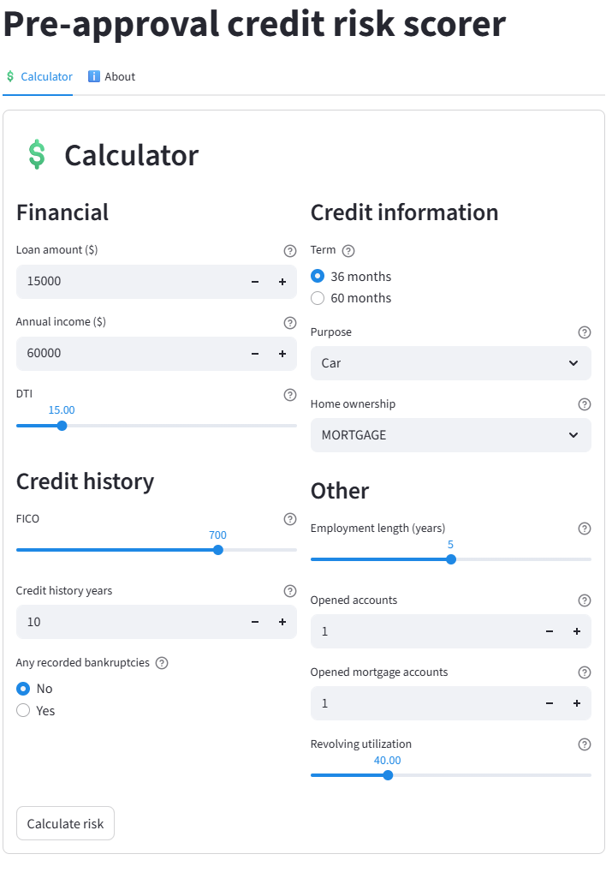

# 🏦 Pre-approval credit risk scorer

## Overview
End-to-end ML project that automates preliminary credit risk assessment. 
The system evaluates loan applications at an early stage using only data 
available before approval (such as FICO, DTI, and employment 
history), intentionally excluding post-approval metrics like loan grade or 
interest rate to simulate a real pre-approval scenario.

**[Live demo link](https://olek2852-pre-approval-credit-risk-scorer-app-k7tjc8.streamlit.app/)**

## UI Preview


## Objective
In lending, reducing defaults while maintaining approval rate is critical. 
This project focuses on:
- Identifying high-risk applicants before final approval.
- Avoiding data leakage by excluding post-approval features.
- Maximizing Recall to ensure high risk borrowers are flagged to minimize potential financial losses.

## Project structure
The project is split into two stages:

**Stage 1: Modelling (Jupyter Notebook)**  
Data cleaning and EDA on 2.2M records, feature engineering, XGBoost training 
with Optuna hyperparameter tuning and model explainability using SHAP analysis. Includes handling severe class imbalance (80:20) and threshold optimization for Recall.

**Stage 2: Deployment (Streamlit)**  
Web app that runs the model in real time. Users can input applicant data, 
get a risk score with probability, and browse prediction history for the 
current session. The About tab includes interactive EDA and SHAP charts from the dataset.

## Model performance
| Metric | Value |
|--------|-------|
| ROC-AUC | 0.701 |
| Gini | 0.402 |
| Recall (threshold 0.4) | 0.83 |

## Dataset
[All Lending Club loan data](https://www.kaggle.com/datasets/wordsforthewise/lending-club) 
2.2M records, significant missing values, 80:20 class imbalance.

## Tech stack
Pandas, NumPy, Matplotlib, Seaborn, Scikit-Learn, XGBoost, Optuna, Streamlit

## Repository structure
```
├── app.py                    # Streamlit app
├── credit_model.pkl          # Trained model
├── credit_notebook.ipynb     # Jupyter notebbok with EDA, preprocessing and model training
├── feature_importances.png   # SHAP feature importance plot
├── form.png                  # UI screenshot
├── requirements.txt          
├── train_small.csv           # 50K records sample dataset
```
## Run locally
1. Clone the repository
2. `pip install -r requirements.txt`
3. `streamlit run app.py`