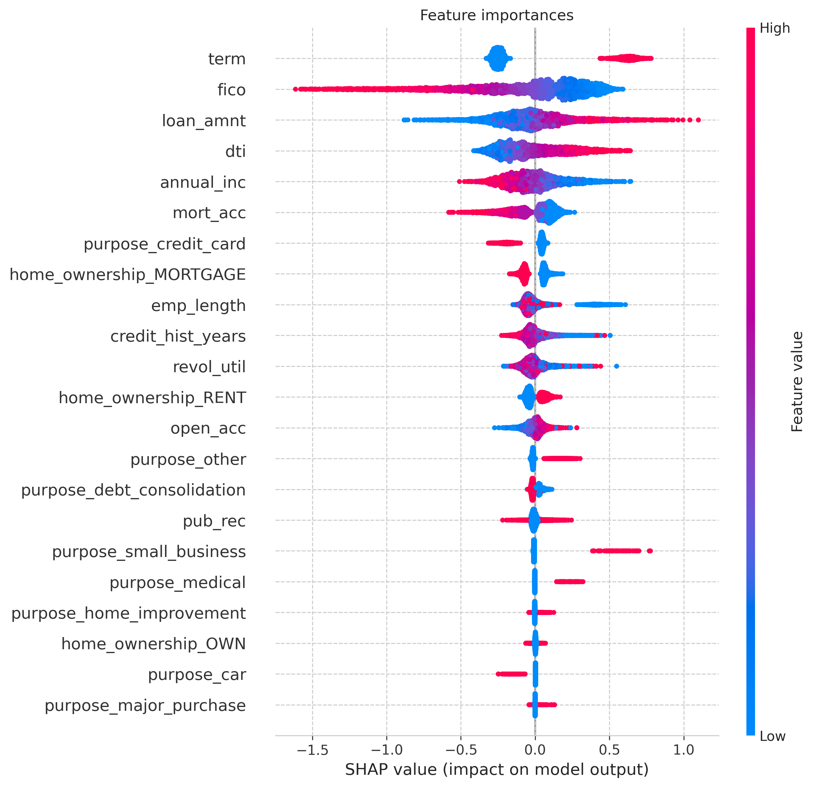

# 🏦 Pre-approval credit risk scorer

## Overview
Data analysis and machine learning project focused on understanding and predicting preliminary credit risk. 
The system evaluates loan applications at an early stage using only data 
available before approval (such as FICO, DTI, and employment 
history), intentionally excluding post-approval metrics like loan grade or 
interest rate to simulate a real pre-approval scenario.

**[Live demo link](https://olek2852-pre-approval-credit-risk-scorer-app-k7tjc8.streamlit.app/)**

## UI Preview
<p align="left">
  
</p>

https://github.com/user-attachments/assets/d77b29b7-8fd5-47c5-bd6b-fa1358b06507


## Objective
In lending, reducing defaults while maintaining approval rate is critical. 
This project focuses on:
- Identifying the underlying characteristics of high-risk borrowers through extensive EDA.
- Building a robust predictive scorer to identify high-risk applicants before final approval.
- Maximizing Recall to ensure high risk borrowers are flagged to minimize potential financial losses.

## Key insights
<p align="left">
  
</p>
Based on the extensive data analysis and the SHAP summary plot, the project identified dominant risk factors driving credit risk in this pre-approval scenario. The reasoning behind the data and the model’s decisions is explained below, divided by category:

**Credit related features:**
- **Loan term is the most powerful categorical predictor.** Long term loans (60 months) present an exceptionally high inherent risk, with 35% ending in default. Conversely, short-term loans (36 months) are a strong protective factor for the lender, presenting a much lower default rate of 17%.
- **Borrowers requesting larger loan amounts are consistently categorized as higher risk.** High feature values are a strong driver of defaults, while low amounts correlate with a higher probability of repayment.
  
**Applicant related features:**
- **FICO score is the primary signal of financial health.** It is the strongest force pushing predictions towards default. High FICO scores act as the most powerful overall factor in reducing default risk, directly signaling a strong history of repayment.
- **The debt-to-income ratio is a major driver of risk.** High feature values consistently push predictions towards default, as borrowers with significant existing debt relative to their income are more likely to experience repayment difficulties.
- **Annual income dictates capacity for repayment.** Higher annual incomes demonstrate the underlying financial stability and the capacity to meet loan obligations, notably reducing the likelihood of default. Low income correlates directly with higher risk.
  
## Project structure
The project is split into two stages:

**Stage 1: Data analysis & modelling (Jupyter Notebook)**  
Extensive data cleaning and exploratory data analysis on 2.2M records to extract actionable business insights. The analytical foundation was then integrated into a Scikit-Learn Pipeline for feature engineering and model training. Includes Optuna hyperparameter tuning, handling severe class imbalance (80:20), threshold optimization for Recall, and model explainability using SHAP.

**Stage 2: Interactive dashboard (Streamlit)**  
A comprehensive web app that not only provides risk scoring based on user inputs, but also allows users to explore EDA charts and SHAP values in the "About" tab to uncover the reasoning behind the data and the model's decisions.

## Model performance
In preliminary credit risk modeling, predicting human behavior using only pre-approval data is highly complex. The goal was not to achieve perfect accuracy, but to create a robust initial filter.

| Metric | XGBoost | Logistic Regression (Baseline) |
|--------|---------|--------------------------------|
| ROC-AUC | **0.701** | 0.686 |
| Gini | **0.402** | 0.372 |
| Recall (threshold 0.4) | 0.83 | --- |

- **Baseline comparison:** A standard Logistic Regression was evaluated as a baseline (ROC-AUC 0.686). The chosen XGBoost model successfully outperformed it, demonstrating its ability to capture complex, non-linear relationships within the credit profiles that simpler linear models missed.
- **ROC-AUC & Gini:** A Gini coefficient of 0.402 (AUC ~0.70) indicates a strong predictive capability for early-stage behavioral and financial data, effectively separating reliable from risky applicants without relying on deep credit bureau history.
- **Precision-Recall Trade-off:** Because the dataset is heavily imbalanced (80:20), a strategic decision was made to lower the classification threshold to 0.4.
  
Recall (0.83): The model successfully flags 83% of all actual defaults. This aligns with the primary business objective: catching potential financial losses as early as possible.

Precision (0.28): This high recall comes at the cost of lower precision, leading to a high rate of false positives. In a real-world pre-approval scenario, this is an acceptable trade-off. Applicants flagged by this model wouldn't be outright rejected; instead, they would be routed for manual underwriting review or required to provide additional documentation

## Dataset
[All Lending Club loan data](https://www.kaggle.com/datasets/wordsforthewise/lending-club) 
2.2M records, significant missing values, 80:20 class imbalance.

**Limitations & context**

It is important to note that Lending Club is a Peer-to-Peer lending platform. The borrower demographic often includes individuals consolidating heavy existing debt or those who might have been rejected by traditional banks. 

Consequently, the baseline default rate in this dataset (~20%) is significantly higher than in typical commercial bank portfolios. The model's baseline risk assumptions reflect this high-risk P2P lending environment, meaning the absolute probability scores might need recalibration if applied to a standard, real-life banking population.

## Tech stack
**Data analysis & visualization:** Pandas, NumPy, Matplotlib, Seaborn, Streamlit  
**Machine learning:** Scikit-Learn, XGBoost, Optuna, SHAP

## Repository structure
```
├── app.py                    # Streamlit app
├── credit_model.pkl          # Trained model
├── credit_notebook.ipynb     # Jupyter notebook with EDA, preprocessing and model training
├── feature_importances.png   # SHAP feature importance plot
├── form.png                  # UI screenshot
├── requirements.txt          
├── train_small.csv           # 50K records sample dataset
```
## Run locally
1. Clone the repository
2. `pip install -r requirements.txt`
3. `streamlit run app.py`
